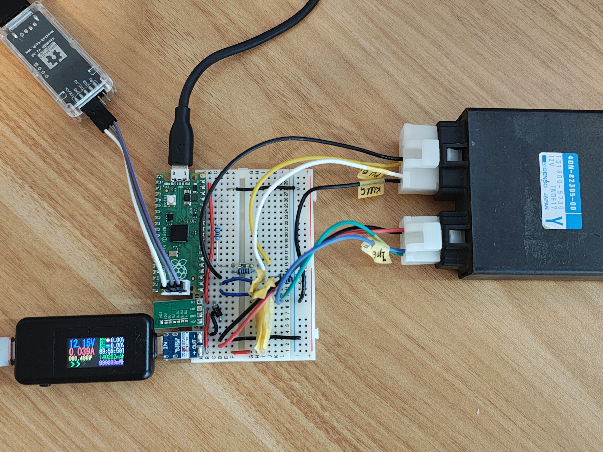

# 4dn-firing-timing-probe

A Raspberry Pi Pico (RP2040) bench instrument that maps the ignition **advance
curve (°BTDC vs RPM)** of a Denso TNDF17 CDI ignitor (as fitted to the Yamaha
SRV250, renessa). It emulates the crankshaft pickup at a commanded RPM,
timestamps the resulting ignition-coil fire events, and writes the per-cylinder
timing to CSV files on an onboard FAT volume, retrieved over USB mass storage.

No engine required: the Pico is both the stimulus (a synthesized pickup pattern)
and the instrument (dual-edge capture + crank-angle reconstruction).



> [!NOTE]
> This project is created with the help of AI. The schematic is made manually,
> but the firmware and documentation are generated with claude code.

## How it works

The Pico drives a synthesized VR/pickup pulse train on GP18 matching the SRV250
trigger wheel (4 teeth, 60/60/60/180°) at a commanded RPM. It captures both
edges of the ignitor's two coil outputs (GP16/GP17) and of its own emitted
pickup (GP18 self-capture) with the PIO on one shared 62.5 MHz timebase, then
computes each spark's °BTDC by interpolating its position between the bracketing
pickup edges relative to per-cylinder TDC. Details in
[docs/architecture.md](docs/architecture.md).

## Run modes & output

`RUN_MODE` in `CONFIG.INI` selects the run; results land as CSV on the USB drive:

| Mode | What it does | Output |
|------|--------------|--------|
| `STEPPED` | Hold each RPM step, average N samples → advance map | `MAP_###.CSV` |
| `RAMP_UP` / `RAMP_DOWN` | Continuous RPM sweep, one row per spark | `RAMPU###.CSV` / `RAMPD###.CSV` |
| `HOLD` | Hold a constant RPM indefinitely, one row per spark | `HOLD###.CSV` |

## Quick start

1. **Flash the firmware.** Download the latest
   prober.uf2 from the project's GitHub [Releases][] page, then hold
   **BOOTSEL** while plugging in the Pico (it mounts as `RPI-RP2`) and copy the
   `.uf2` onto it. (Building from source instead:
   [docs/development.md](docs/development.md).)
2. **Wire the harness** to the ignitor — pin map in
   [docs/architecture.md](docs/architecture.md#hardware); board files and
   PCB/breadboard notes in [schematics/](schematics/README.md).
3. Mount the Pico's USB drive and edit `CONFIG.INI` — **run parameters only**;
   the wheel/TDC geometry is baked into the firmware.
4. **Reset** the Pico (config is read at boot), wait for the LED at 1 Hz
   (Ready), then press **BOOTSEL** to start the run.
5. Wait for the LED to return to steady **1 Hz (Ready)** — the run finished and
   the CSV is flushed — then replug the drive and copy the file. (Copying before
   the LED is Ready is too early; the file is written only at end-of-run.)

[Releases]: https://github.com/doge-gif/4dn-firing-timing-probe/releases/latest

## Repository layout

```
firmware/      C++20 firmware — core/ (SDK-free, host-tested), hal/, app/, tests/
schematics/    KiCad board + PCB/breadboard notes (schematics/README.md)
ci/            CI entry point (container build + lint + test)
docs/          architecture.md, development.md, refs/ (third-party sources)
flake.nix      Nix devShell (pinned toolchain: arm-none-eabi-gcc, probe-rs, …)
```

## License

Project source: see [LICENSE](LICENSE). Third-party reference materials indexed
in [docs/refs/SOURCES.md](docs/refs/SOURCES.md) remain under their own licenses.
